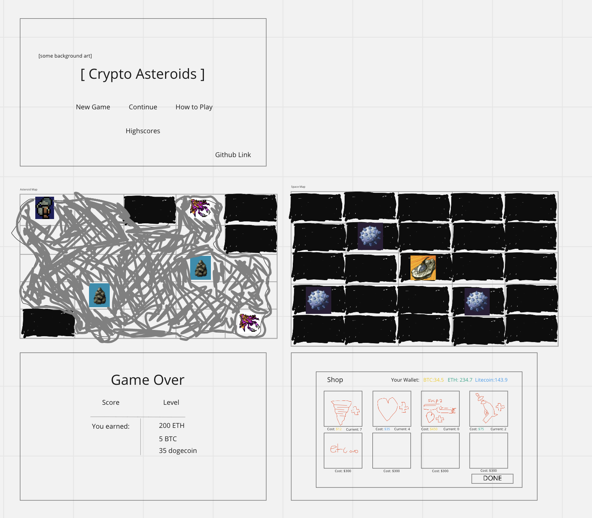

### Group Project: Begin Wireframes & Software Requirements
#### Wireframes

#### User Stories

1. User Stories:

- Upgrades
- As a player, I want to be able to upgrade my character
- Feature Tasks:
- Shop interface
- Stronger drills
- HP increase
- Weapon
- possibilities:
- Larger inventory
- Ship health
- Acceptance tests:
- Does the upgraded drill actually mine a given rock faster?
- Is the HP increase properly represented?

1. Health
- As a player, I want to be able to see my health bar to know how close to dying I am.
- Feature Tasks:
- Display Health bar
- Heal player
- ake damage
- Acceptance Tests:

1. Level
- As a player, I want to be able to explore my Level bar 
- Feature Tasks:
- The starting level is 1 and the highest level is 5
- Acceptance Tests:
- The level counter accurately updates to match how many asteroids the player has been to. 

1. Challenge
- As a player, I want a fair challenge that motivates mindful play
- Feature Tasks:
- Enemies that scale in difficulty as time passes
- Meaningful upgrades to customize how to approach them
- Acceptance Tests:
- Check that enemies actually evolve at set intervals

1. Graphics
- As a player, I want retro 16x16 animated sprites
- Feature Tasks:
- 2-5 frames per sprite
- Sprites should clearly appear on which tile they’re on; ie. the player should be - - Able to tell how far away an enemy or a rock is.
- Acceptance Tests:
- Visual test

1. Software Requirements
- Pygame

1. Domain Modeling
- 

1. Using a Database? Make an Database Schema Diagram
- Not Applicable
